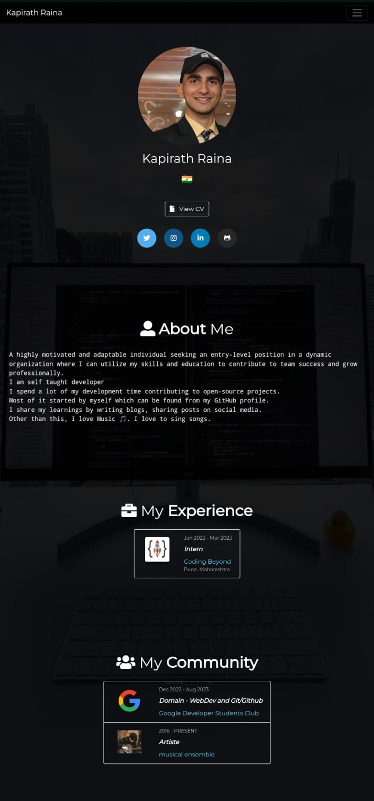

<h1 align="center">portfoliowannabe</h1>
<h3 align="center">A clean, simple portfolio highlighting my work and skills in web development.</h3>


<p align="center">
  <a href="#-about-the-project">About the project</a>&nbsp;&nbsp;&nbsp;|&nbsp;&nbsp;&nbsp;
  <a href="#-getting-started">Getting started</a>&nbsp;&nbsp;&nbsp;|&nbsp;&nbsp;&nbsp;
  <a href="#-how-to-contribute">How to contribute</a>&nbsp;&nbsp;&nbsp;|&nbsp;&nbsp;&nbsp;
  <a href="#-license">License</a>
</p>

🚀 Project Overview

PortfolioWannabe2 is a responsive, modern portfolio website designed to highlight my professional journey, showcase my projects, and provide a platform for connecting with potential collaborators or employers.

<p align="center">
  
</p>

🛠️ Built With

- HTML5 & CSS3: For structuring and styling the website.
- JavaScript: For adding interactivity and dynamic content.

🌟 Features

- Responsive Design: Optimized for desktop and mobile devices.
- Project Showcase: A dedicated section to display my best projects with live demos and code links.
- Contact Form: Allows visitors to get in touch with me directly.

📂 Project Structure

```plaintext
portfoliowannabe2/
├── index.html       # Main HTML file
├── css/             # CSS stylesheets
├── js/              # JavaScript files
├── images/          # Images and assets
└── README.md        # Project documentation
```

🎯 Getting Started

To view the portfolio locally:

1. Clone this repository:
   ```bash
   git clone https://github.com/kapirath28/portfoliowannabe2.git
   ```
2. Open `index.html` in your browser.

🤝 Contributing

Contributions are welcome! Feel free to open an issue or submit a pull request.

📬 Contact

Feel free to reach out to me via kapirathraina@gmail.com or connect with me on https://x.com/kapsayshieeee.

---

Thank you for visiting my portfolio repository! I hope you enjoy exploring my work as much as I enjoyed creating it.
```

Available for coffee date with a open mic!!!.
